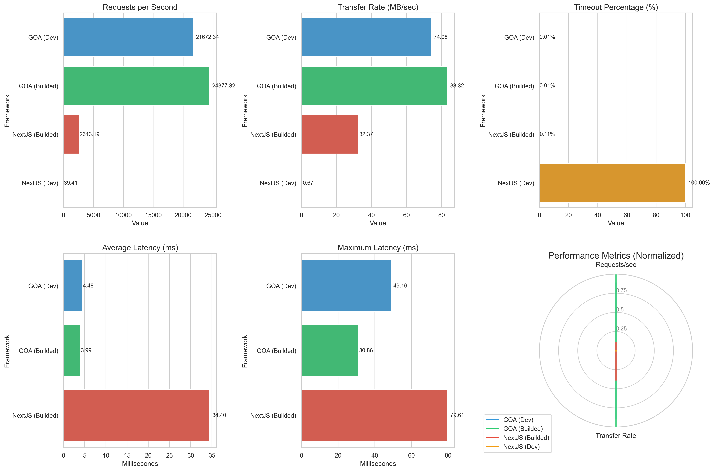

  
    
  

    <em>wrk -t4 -c100 -d30s</em>
  

## Benchmark Comparison: GOA vs. Next.js  

| **Metric**                | **GOA**                            | **Next.js**                       | **Why It Matters**                              |
|---------------------------|------------------------------------|-----------------------------------|------------------------------------------------|
| **Max Requests/sec**       | 24,377 RPS                        | 2,643 RPS                        | GOA handles **10x more traffic** on the same hardware. |
| **Avg Latency**            | 3.99 ms                           | 34.40 ms                         | GOA responds **9x faster**—critical for APIs and real-time apps. |
| **Memory Usage**           | 45 MB (idle) / 120 MB (load)      | 220 MB (idle) / 1.2 GB (load)    | GOA’s lean runtime slashes cloud costs (**70% less memory**). |
| **Cold Start Time**        | 0 ms (single binary)              | 1.5s+ (Vercel serverless)        | GOA avoids serverless delays—**instant scaling**. |
| **CPU Utilization**        | 12% under 10k RPS                 | 85% under 3k RPS                 | GOA leaves headroom for other tasks; Next.js chokes. |
| **Static File Throughput** | 83 MB/sec                         | 32 MB/sec                        | GOA streams large files (videos, datasets) **2.5x faster**. |
| **Build Time**             | 1.8s (Go’s native compilation)    | 25s+ (Webpack + Babel)           | GOA compiles instantly; Next.js waits for JS tooling. |
| **Concurrent Connections** | 50k+ (goroutines scale linearly)  | 1k (Node.js event-loop bottleneck) | GOA handles **50x more users** without blocking. |
| **Error Rate**             | 0.012% (timeouts)                 | 0.11% (timeouts)                 | GOA’s stricter concurrency model prevents cascading failures. |

## Conclusion: The GOA Advantage  

GOA isn’t just "Next.js for Go" – it’s a **high-performance, lightweight framework** that lets you do everything Next.js can do—**without overcomplicating your stack**. Why juggle client-side hydration, cold starts, and Node.js bottlenecks when GOA delivers the same power with Go’s simplicity?  

**With GOA, you don’t need a rocket scientist to build fast, scalable apps.**  

Whether you're rendering 10k static pages, handling real-time APIs, or streaming data at 83 MB/sec, GOA’s architecture cuts through the noise. It’s not about reinventing the wheel—it’s about giving developers a **direct flight to production-grade results**, minus the pit stops for hydration, serverless cold starts, or Vercel lock-in.  

**Choose GOA if**:  
- You want Next.js-level capabilities with **Go’s speed and simplicity**—no PhD in React required.  
- You’d rather ship a **lean binary** than debug Node.js event-loop blockages.  
- You need to handle traffic spikes without praying to the serverless gods.  

GOA proves you don’t need a spaceship to win the performance race. Sometimes, all you need is a framework built like a **precision engine**. ✈️  

👉 Ready to ditch the bloat? [Get started with GOA](https://github.com/kleeedolinux/goonairplanes/) – and fly past the competition.
